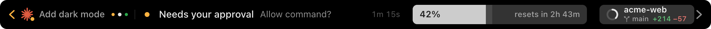
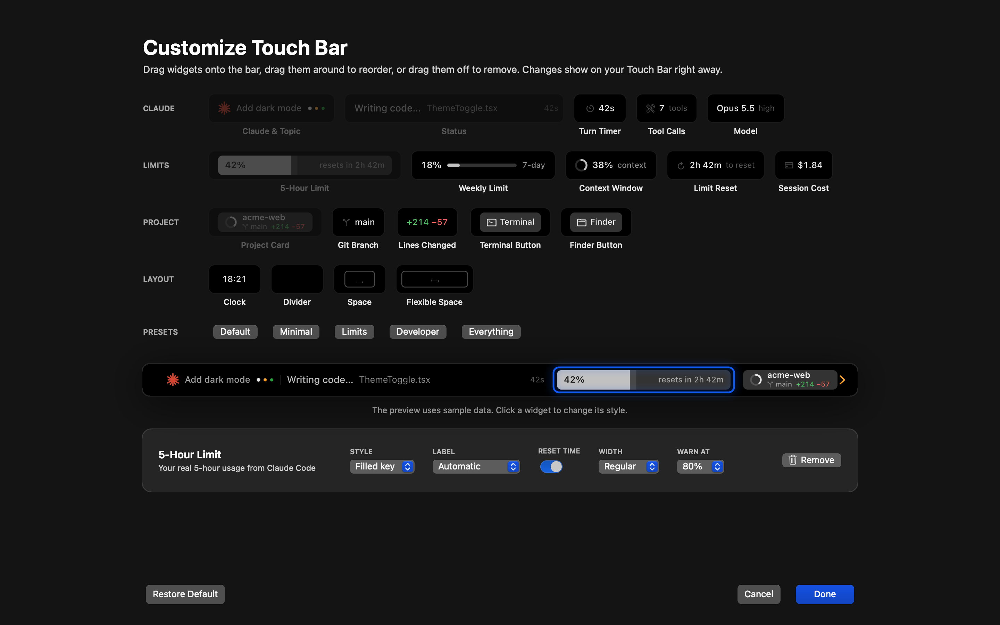

<div align="center">

# Claude Touch Bar

**See what Claude Code is doing on your MacBook's Touch Bar, answer it with one tap, and build the bar you want.**


<sub>Recorded on a real Touch Bar in demo mode</sub>

Native macOS · Swift + Core Animation · no Electron · ~10 ms hooks · no polling

[Download](../../releases/latest) · [Install](#install) · [Features](#features) · [Customize](#make-it-yours) · [How it works](#how-it-works)

</div>

---

Claude Code works in a terminal you're often not looking at. Claude Touch Bar puts a calm, glanceable bar on your Touch Bar that tells you what Claude is doing, how much of your limit is left, and when Claude needs you.


1. **Is Claude working?** The Claude mark breathes while it works, pulses once when it's done, and gets a coloured badge when Claude needs you.
2. **What is it doing?** The live status from Claude Code's hooks (*Writing code… ThemeToggle.tsx*, *Running tests…*) with a turn timer that ticks in sync with the terminal.
3. **How much of my limit is used?** Your real 5-hour `rate_limits` usage, with the time until the window resets.
4. **Which project?** Project name, git branch, lines changed this session, and a ring showing how full the context window is.

## Features

### Answer Claude from the Touch Bar

When Claude asks for permission, asks you a question, or wants its plan approved, the right side of the bar turns into answer keys. Tap once and Claude carries on. The terminal dialog still works too: whichever answer comes first wins, so nothing ever blocks.


| Claude is waiting on | Keys |
|---|---|
| A command, edit or tool | **Deny** · **Always** (when Claude offers a "don't ask again" rule) · **Allow** |
| A question (`AskUserQuestion`) | One key per option, with the recommended one in blue. Multi-select keys toggle and **Done** sends. |
| A plan | **Keep planning** · **Approve** |

Prefer to answer in the terminal? Turn off **Behavior → Answer Claude from the Touch Bar** and the bar only shows the question.

### Every session, one swipe away

Running several Claude Code sessions? The dots next to the topic show your other sessions in the colour of their state. Swipe, or tap **‹ ›**, to switch between them. The bar follows whichever session needs you most, and an arrow glows amber when a session off-screen is waiting for permission.



### Tap anything for details


Tapping the Claude mark jumps to the terminal running that session (Terminal, iTerm2, Ghostty, VS Code and more).

## Make it yours

Open **Customize Touch Bar…** from the menu bar. A full-screen editor appears, much like macOS's own Touch Bar customization:

- **Drag** widgets from the palette onto the bar, or double-click one to add it.
- **Drag** widgets along the bar to reorder them. The bar makes room as you move.
- **Drag** a widget off the bar, or select it and press <kbd>⌫</kbd>, to remove it.
- **Click** a widget to change its style in the inspector.

Every change shows on your real Touch Bar as you make it. **Cancel** puts everything back.



### 19 widgets

| Group | Widgets |
|---|---|
| **Claude** | Claude & Topic · Status · Turn Timer · Tool Calls · Model |
| **Limits** | 5-Hour Limit · Weekly Limit · Context Window · Limit Reset · Session Cost |
| **Project** | Project Card · Git Branch · Lines Changed · Terminal Button · Finder Button |
| **Layout** | Clock · Divider · Space · Flexible Space |

### Style every widget

Meters (5-hour limit, weekly limit, context window) come in five styles, each with its own width, label and warning threshold:

| Style | |
|---|---|
| Filled key |  |
| Segments |  |
| Slim bar |  |
| Ring |  |
| Text only |  |

Other widgets have options too. For example:

- **Claude & Topic:** show or hide the topic and session dots, choose lively, calm or no animation, and colour the mark Claude orange, white, or by status.
- **Status:** show or hide the file or command, the timer and the shimmer.
- **Project Card:** choose what the second line shows, and show or hide the context ring.
- **Clock:** system, 24-hour or 12-hour, with an optional weekday.

### Presets

Start from a preset in the editor, or switch layouts straight from the menu bar under **Layout**.

| Preset | |
|---|---|
| Minimal |  |
| Limits |  |
| Developer |  |
| Everything |  |

### Small things done properly

- **Real data only.** The status comes from real hook events, and the usage from Claude Code's own status line. Without it, the time in the window is estimated and marked with `~`.
- **Battery friendly.** All looping motion runs in the Core Animation render server. There is no polling: the app wakes up on Darwin notifications and FSEvents.
- **Works without a Touch Bar.** A floating on-screen preview shows the same bar on any Mac.
- **Safe install.** It only adds its own entries to `~/.claude/settings.json`, backs the file up first, and keeps your existing status line working.
- **Demo mode.** A scripted, realistic session so you can try everything before connecting it.

## Install

**Requirements:** macOS 13 or later, [Claude Code](https://docs.anthropic.com/en/docs/claude-code), and a MacBook Pro with a Touch Bar. Other Macs get the on-screen preview.

### Download

1. Get `Claude Touch Bar.zip` from the [latest release](../../releases/latest) and move the app to `/Applications`.
2. The app is ad-hoc signed, not notarized, so on first launch clear the quarantine flag:
   ```bash
   xattr -dr com.apple.quarantine "/Applications/Claude Touch Bar.app"
   ```
3. Open it, click the ✳ icon in the menu bar, and choose **Connect to Claude Code…**

### Build from source

Only the Xcode Command Line Tools are needed (Swift 5.10 or later), not Xcode:

```bash
git clone https://github.com/<you>/claude-touchbar.git && cd claude-touchbar
scripts/build-app.sh --install     # builds, signs ad-hoc, copies to /Applications and launches
```

### Connect to Claude Code

Use **Connect to Claude Code…** in the menu, or the command line:

```bash
"/Applications/Claude Touch Bar.app/Contents/Helpers/cctb" install     # backs up settings.json first
"/Applications/Claude Touch Bar.app/Contents/Helpers/cctb" uninstall   # removes only its own entries
```

Even without hooks the app runs in *basic* mode: it sees running sessions, whether each one is busy or idle, and the project and branch.

## Settings

Everything else is in the menu bar item:

- **Customize Touch Bar…** and **Layout:** the editor, and quick access to presets.
- **Usage Window:** 3h / 5h / 10h / custom. Nothing is hard-coded to 5 hours.
- **Behavior:** show the bar when Claude starts working, show it when Claude needs you, answer from the Touch Bar, fold it away when Claude isn't running, launch at login.
- **Demo Mode:** a scripted session, always tagged `DEMO`.
- **Show On-Screen Preview:** a floating 1:1 copy of the bar.

The system ✕ on the Touch Bar collapses the bar into a ✳ button in the Control Strip. Tap the button to bring it back.

## How it works

```
Claude Code ──hooks / statusLine──▶ cctb (tiny helper, ~10 ms, always exits 0)
                                      │ atomic JSON writes + Darwin notify
                                      ▼
                 ~/Library/Application Support/ClaudeTouchBar/
                                      │
                                      ▼
              Claude Touch Bar.app ── widgets (Core Animation) ──▶ Touch Bar
```

- `cctb` is registered as a Claude Code hook and status line command. It records what Claude is doing and your `rate_limits` usage, then wakes the app.
- Permission prompts use the `PermissionRequest` hook. It runs **alongside** the terminal dialog, so answering from the terminal or from the Touch Bar both work.
- A bar that stays visible across all apps needs the private `DFRFoundation` API, which is looked up at runtime. If it isn't available, the app falls back to the on-screen preview.

See [ARCHITECTURE.md](ARCHITECTURE.md) for the data sources and design decisions.

## Development

```bash
swift build
swift test
.build/debug/ClaudeTouchBar --snapshot /tmp/snap                        # PNG of every bar state, style and preset
.build/debug/ClaudeTouchBar --snapshot-customizer /tmp/customizer.png   # the editor, rendered offscreen
cctb status                                                             # what the app currently sees
cctb dump                                                               # render the live Touch Bar view + widget frames
cctb customize                                                          # open the editor
```

Issues and pull requests are welcome.

## License

[MIT](LICENSE)

---

<sub>Not affiliated with or endorsed by Anthropic. "Claude" and "Claude Code" are trademarks of Anthropic.</sub>
